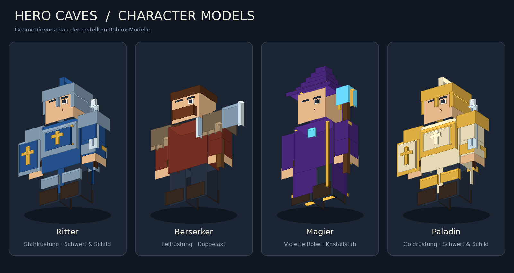

# Hero Caves – Roblox-Spiel

**[Spiel herunterladen](https://github.com/Radorrrr/rador/raw/refs/heads/main/hero-caves/HeroCaves.rbxlx)** · **[Update für dein bestehendes Spiel](https://github.com/Radorrrr/rador/raw/refs/heads/main/hero-caves/HeroCavesUpdate.rbxmx)** · **[Alle Dateien als ZIP](https://github.com/Radorrrr/rador/raw/refs/heads/main/hero-caves/HeroCaves.zip)**

## Dieses Update
- Waffen sitzen in den Händen und bewegen sich mit der gesamten Gelenkkette.
- Schulter, Ellbogen und Handgelenk spielen Ausholen, Schlag und Rückkehr ab. Separate Bewegungen für Schwert, Axt und Stab.
- Nahkämpfer stehen näher am Gegner. Schaden erfolgt nach 0,34 Sekunden beim Schlag; Magie trifft nach der Projektilflugzeit.
- Gold, gekaufte Helden, Levels, aktuelle Welle und Boss-Farmmodus werden dauerhaft gespeichert.
- Speichern alle 45 Sekunden, beim Verlassen und beim Schließen des Servers. In der Oberfläche erscheint der Speicherstatus.

## Update in deinem bestehenden Spiel (empfohlen)
Damit eigene Map-Änderungen und die Zuordnung zur Roblox-Experience erhalten bleiben, ersetze nur die Spielscripte:

1. Öffne dein bisheriges Spiel in Roblox Studio. Beende einen laufenden Play-Test und sichere eine Kopie deiner Datei.
2. Lade **HeroCavesUpdate.rbxmx** über den Update-Link oben herunter.
3. Importiere die Datei in **Workspace**, über **Aus Datei einfügen / Insert from File**. Im Explorer muss jetzt ein Ordner **HeroCavesUpdate** unter Workspace stehen. Die importierten Scripts sind zunächst deaktiviert.
4. Öffne die **Befehlsleiste / Command Bar** in Studio, gegebenenfalls über die Studio-Suche.
5. Öffne [UpdateInStudio.lua](https://github.com/Radorrrr/rador/blob/main/hero-caves/UpdateInStudio.lua), kopiere den kompletten Code und führe ihn in der Befehlsleiste aus. Er installiert die fünf Scripts/Module und legt die vorherigen Versionen unter **ServerStorage → HeroCavesBackup_…** ab. Map und eigene Modelle werden nicht ersetzt.
6. Veröffentliche das Update **in derselben Experience**. Erstelle für ein Update kein neues Roblox-Spiel.

Alternativ kannst du die fünf Script-Inhalte von Hand ersetzen:

| Datei | Ziel in Studio | Typ |
| --- | --- | --- |
| Game.server.lua | ServerScriptService → HeroCavesServer | Script |
| SaveData.lua | ServerScriptService → SaveData | ModuleScript |
| Game.client.lua | StarterPlayer → StarterPlayerScripts → HeroCavesClient | LocalScript |
| CharacterDesign.lua | ReplicatedStorage → CharacterDesign | ModuleScript |
| CombatAnimation.lua | ReplicatedStorage → CombatAnimation | ModuleScript |

## Dauerhaft speichern aktivieren
1. Veröffentliche dein Spiel mindestens einmal in Roblox, damit es einer Experience zugeordnet ist.
2. Für Tests in Studio: **Spieleinstellungen → Sicherheit → Studio-Zugriff auf API-Dienste aktivieren / Enable Studio Access to API Services** einschalten und speichern. Starte den Test anschließend neu.
3. Spiele im normalen Solo-Test, sammle Gold und beende den Test. Beim erneuten Start müssen Gold, Heldenlevels und Welle wieder geladen werden.

Im veröffentlichten Spiel erfolgt das Speichern serverseitig über Roblox DataStores. Die Daten gehören zur **Experience (Universe)** und zur Spieler-ID, nicht zur heruntergeladenen Datei. Eine neue lokale Datei muss daher wieder mit derselben Experience verbunden/veröffentlicht werden. Im Zweifel das Script-Update oben verwenden.

Studio verwendet einen **separaten Test-Spielstand**, damit Testgold keinen Live-Spielstand überschreibt. Lokale Mehrspieler-Testidentitäten mit negativen Spieler-IDs und unveröffentlichte Places laufen weiterhin nur für die aktuelle Sitzung. Ladefehler starten bei bestehenden Online-Profilen keinen leeren Ersatzspielstand; der Beitritt wird mit einem Hinweis beendet. Gleichzeitige Serverzugriffe werden durch eine Sitzungssperre geschützt.

Vor diesem Update existierten keine gespeicherten Daten. Bereits beendete alte Spielstände können nicht nachträglich wiederhergestellt werden. Gegner-Lebenspunkte und ein laufender Boss-Timer werden nicht gespeichert; ein geladener Gegner startet mit voller Gesundheit.

## Neues Projekt starten
Öffne **HeroCaves.rbxlx** über **Datei → Aus Datei öffnen**, klicke **Play** und **Zu meiner Base**. Die Map wird beim Start aufgebaut. Für dauerhafte Daten anschließend veröffentlichen und die obigen Einstellungen beachten.

## Spielregeln
- Eigene Base pro Spieler, kostenlose Startfigur Ritter.
- Ritter, Berserker, Magier und Paladin sind jeweils einmal kaufbar und bis Level 100 upgradebar.
- Heldenkauf nahe dem Händler: beim NPC **E** drücken oder den Prompt antippen. Der Held läuft zur Base und greift erst nach Ankunft an.
- Passive Gegner kommen aus der Höhle. Bei Tod wird Gold sofort gutgeschrieben.
- Boss auf Welle 5, 10, 15 usw.; exakt zehnfache HP des Gegners davor und 30 Sekunden ab Ankunft im Kampfbereich.
- Nach Zeitablauf erscheint die Welle davor zum Gold-Farmen. **Boss erneut versuchen** startet einen frischen Boss.
- Angriffsgeschwindigkeit pro Held bleibt konstant; Upgrades steigern den Schaden.
- Schmied und Chronist sind noch Platzhalter.

## Modelle und Animationen
Die `.rbxmx`-Dateien enthalten eigene Part-Modelle mit vier Motor6D-Gelenken: Schulter, Ellbogen, Handgelenk und Waffengriff. Details sind an ihre jeweilige Körper- oder Waffenkomponente geschweißt. Nur der Torso ist verankert.

Das Spiel erzeugt die Figuren aus **CharacterDesign.lua**. Die statischen Kopien unter **ServerStorage → CharacterModels** dienen zum Betrachten und Bearbeiten. Änderungen an diesen Kopien wirken sich nicht automatisch auf die erzeugten Helden aus.

**CombatAnimation.lua** bewegt die Gelenke durch serverseitige Keyframe-Tweens. Es sind keine hochgeladenen Animation-Assets erforderlich. Die Figuren sind individuelle Gelenkmodelle, keine Standard-R15-Avatare. Materialien wie Metall, Stoff, Holz und Neon funktionieren ohne zusätzliche Asset-IDs.

## Werte und Entwicklung
Heldenwerte stehen am Anfang von **Game.server.lua**. `cost` ist der Kaufpreis, `damage` der Schaden pro Angriff, `speed` die Angriffe pro Sekunde. Die Speicher-Namen in **SaveData.lua** bei normalen Updates beibehalten, damit bestehende Daten erhalten bleiben.

Modelle generieren: `python design_characters.py`. Place und Update-Paket generieren: `python build_place.py`. Vorschau: `python render_models.py` (Pillow erforderlich).

Prüfungen: `luatex --luaonly check.lua`, `luatex --luaonly test_save.lua`, `luatex --luaonly test_combat.lua`, `python validate_models.py`. Die Lua-Tests prüfen Speicherlogik und Animationsabläufe mit simulierten Roblox-Diensten. Ein echter Studio-Laufzeittest einschließlich DataStore-Zugriff, Gelenkbewegung und Mehrspielerbetrieb ist noch erforderlich.
