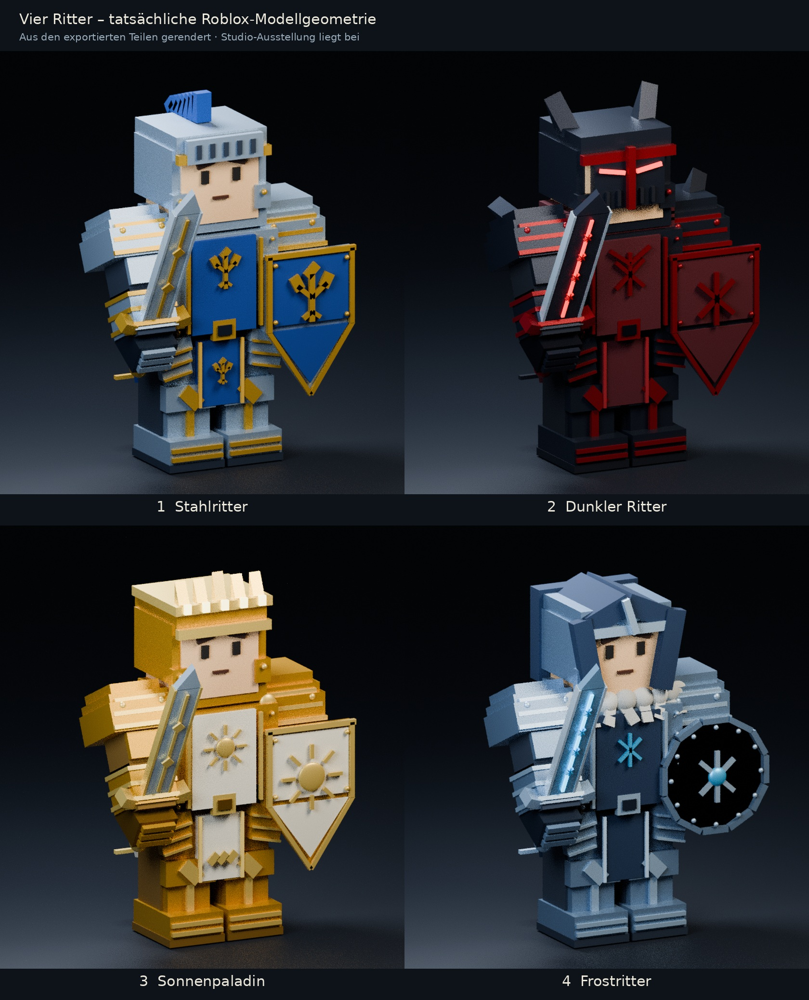

# Vier Ritter – echte Roblox-Modellgeometrie

**[Modellvorschau als JPG ansehen](https://github.com/Radorrrr/rador/blob/main/hero-caves/designs/roblox-knights/Ritter-Roblox-Vorschau.jpg)**

**[Ausstellung für Roblox Studio herunterladen](https://github.com/Radorrrr/rador/raw/refs/heads/main/hero-caves/designs/roblox-knights/Ritter-Ausstellung.rbxlx)** · **[Alle vier Modelle als ZIP herunterladen](https://github.com/Radorrrr/rador/raw/refs/heads/main/hero-caves/designs/roblox-knights/Ritter-Modelle.zip)**

## Die vier Figuren
1. **Stahlritter:** Stahlrüstung, blauer Wappenrock, goldene Lilien, hochgeklapptes Schlitzvisier, blauer Helmbusch, Schwert und Wappenschild.
2. **Dunkler Ritter:** dunkle Plattenrüstung, roter Schal, geschlossener Helm mit roten Sehschlitzen, Schulterspitzen, breite Runenklinge und Schild.
3. **Sonnenpaladin:** Gold- und Elfenbeinrüstung, Krone, Sonnensymbole, heller Umhang, goldenes Schwert und Sonnenschild.
4. **Frostritter:** stahlblaue Rüstung, Kapuze, Fellkragen, Frost-Runenschwert und Rundschild.

## Direkt in Roblox Studio ansehen
1. Lade **Ritter-Ausstellung.rbxlx** herunter.
2. Öffne sie in Roblox Studio über **Datei → Aus Datei öffnen**. Du musst keinen Play-Test starten.
3. Die vier Figuren stehen nebeneinander. Im Explorer findest du sie unter **Workspace**.
4. Wähle eine Figur aus und drücke **F**, um die Kamera auf sie zu richten. Drehe die Ansicht und zoome heran, um Waffen, Hände, Rüstung und Schilde zu prüfen.

Die Ausstellung ist eine eigene Vorschau-Datei. Veröffentliche sie nicht über dein bestehendes Spiel, wenn du nur die Charaktere ansehen möchtest. Dein bisheriges Spiel wurde nicht geändert.

## Einzelne Modelle in dein Projekt importieren
Lade eine der `.rbxmx`-Dateien herunter oder entpacke die ZIP. Importiere das Modell in deinem eigenen Projekt über **Aus Datei einfügen / Insert from File** in Workspace. Die Figuren sind verankerte Ausstellungsmodelle mit vorbereiteten Motor6D-Gelenken. Sie werden durch den Import noch nicht automatisch zu kaufbaren Helden.

## Was die Bilder zeigen
Die Vorschauen sind in Blender aus **derselben Geometrie, denselben Farben und denselben Teil-Transformationen** wie die exportierten Roblox-Modelle gerendert. Es sind keine neu generierten Konzeptbilder und keine Roblox-Studio-Screenshots. Beleuchtung, Metallreflexionen und Stoffmaterialien können in Studio anders wirken. Die Ausstellung liefert die tatsächliche Roblox-Ansicht.

Die Modelle verwenden nur Part, WedgePart, Ball, Roblox-Materialien, Motor6D und WeldConstraint. Keine Mesh- oder Textur-Uploads und keine fremden Asset-IDs sind nötig. Feine Gravuren und Stofffalten aus den ursprünglichen Konzeptbildern sind vereinfacht; Wappen, Rüstungsplatten, Krone, Fellbüschel und Waffen-Runen sind echte Modellteile.

Jede Figur hat eine bewegliche rechte Schulter, einen Ellbogen, ein Handgelenk und einen Waffengriff. Nur der Torso ist verankert. Modell-Details sind mit dem passenden Körper- oder Waffenteil verschweißt. Die Galerie enthält keine Spielscripte, keine DataStore-Änderungen und keine automatische Angriffsanimation.

## Quellgeometrie
`knight_geometry.json` enthält die Modellteile. `build_knights.py` erstellt Modelle und Studio-Ausstellung; `render_knights.py` erzeugt die Vorschauen in Blender. `compose_preview.py` stellt die Übersicht zusammen. `validate_knights.py` prüft Gelenke, Griffe, Farbwerte und XML-Verweise. Die Strukturprüfungen bestanden; ein tatsächlicher Studio-Importtest ist in der Erstellungsumgebung nicht verfügbar.
